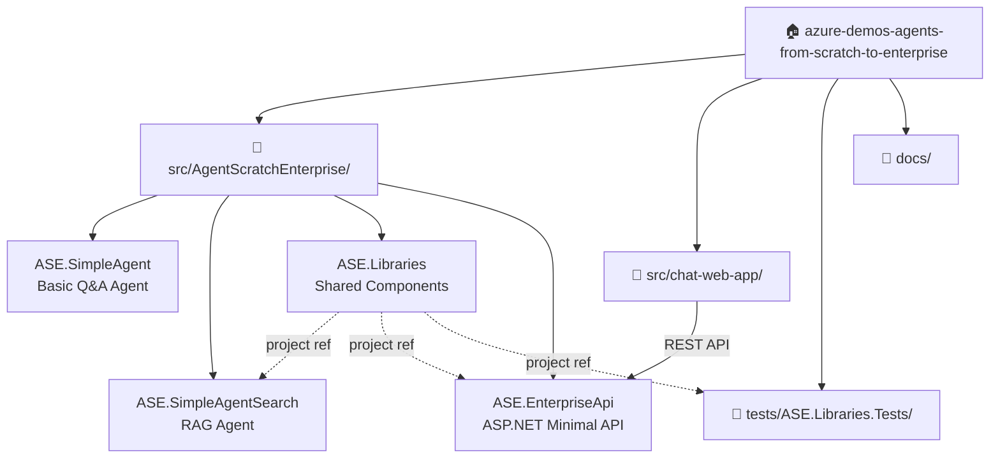

# 🤖 Azure AI Agents - From Scratch to Enterprise

[](https://dotnet.microsoft.com/)
[](https://azure.microsoft.com/)
[](./tests/)
[](./LICENSE)

> **Progressive demonstrations of building AI agents from simple implementations to enterprise-ready solutions using Azure AI services.**

This repository showcases the evolution of AI agents, starting with a basic question-answer agent and progressively adding enterprise features like vector search, RAG (Retrieval-Augmented Generation), caching, API gateways, and comprehensive monitoring.

---

## ✨ Features

| Feature | SimpleAgent | SimpleAgentSearch | Enterprise (Roadmap) |
|---------|:-----------:|:-----------------:|:-------------------:|
| **Basic Q&A** | ✅ | ✅ | ✅ |
| **Document Search** | ❌ | ✅ | ✅ |
| **RAG Pattern** | ❌ | ✅ | ✅ |
| **Vector Search** | ❌ | ❌ | 🔄 |
| **Response Caching** | ❌ | ❌ | 🔄 |
| **API Gateway** | ❌ | ❌ | 🔄 |
| **Monitoring** | ❌ | ❌ | 🔄 |
| **Enterprise Security** | ❌ | ❌ | 🔄 |

**Legend:** ✅ Available | 🔄 Coming Soon | ❌ Not Included

---

## 🚀 Quick Start

### Prerequisites

- ✅ [.NET 10 SDK](https://dotnet.microsoft.com/download/dotnet/10.0)
- ✅ [Azure subscription](https://azure.microsoft.com/free/)
- ✅ [Azure AI Foundry project](https://learn.microsoft.com/azure/ai-foundry/how-to/create-projects)
- ✅ [Azure CLI](https://learn.microsoft.com/cli/azure/install-azure-cli) (for authentication)

### Installation

```bash
# Clone the repository
git clone https://github.com/bovrhovn/azure-demos-agents-from-scratch-to-enterprise.git
cd azure-demos-agents-from-scratch-to-enterprise

# Authenticate with Azure
az login

# Set environment variables
$env:ENDPOINT = "https://your-project.services.ai.azure.com"
$env:DEPLOYMENTNAME = "gpt-4o"

# Run the simple agent
cd src\AgentScratchEnterprise\ASE.SimpleAgent
dotnet run
```

📖 **Detailed setup:** [Getting Started Guide](./docs/getting-started.md)

---

## 📂 Project Structure



> 📊 Full diagrams (flows, class design, test coverage): [docs/diagrams.md](./docs/diagrams.md)

---

## 🎯 Projects Overview

### 1. 🤖 ASE.SimpleAgent

A foundational AI agent demonstrating basic conversational AI capabilities.

**Key Features:**
- Direct Azure AI Projects SDK integration
- Question-answer interactions
- Azure authentication with `DefaultAzureCredential`
- Rich console UI

**Quick Run:**
```bash
cd src\AgentScratchEnterprise\ASE.SimpleAgent
dotnet run
```

📖 **Learn more:** [SimpleAgent Documentation](./docs/projects.md#1-asesimpleagent)

---

### 2. 🔍 ASE.SimpleAgentSearch

An enhanced agent with RAG (Retrieval-Augmented Generation) capabilities for context-aware responses.

**Key Features:**
- Text search provider integration
- Document search and citation
- RAG pattern implementation
- Session-based conversations

**Quick Run:**
```bash
cd src\AgentScratchEnterprise\ASE.SimpleAgentSearch
dotnet run
```

**Example Interaction:**
```
Question: What is the return policy?
Answer: According to the Contoso Outdoors Return Policy, customers may 
return any item within 30 days of delivery...

Source: Contoso Outdoors Return Policy (https://contoso.com/policies/returns)
```

📖 **Learn more:** [SimpleAgentSearch Documentation](./docs/projects.md#2-asesimpleagentsearch)

---

### 3. 📦 ASE.Libraries

Shared library containing reusable components and adapters.

**Key Components:**
- `DocumentSearchAdapter` - Mock search backend (extensible)
- `SearchResult` - Data model for search results
- 100% test coverage

📖 **Learn more:** [Libraries Documentation](./docs/projects.md#3-aselibraries)

---

## 🧪 Testing

The project includes comprehensive unit tests covering all library components.

```bash
cd tests\ASE.Libraries.Tests
dotnet test
```

**Test Results:**
```
✅ Total tests: 51
✅ Passed: 51
✅ Failed: 0
⏱️ Duration: ~8 seconds
```

**Test Coverage:**
- `DocumentSearchAdapterTests` - 8 tests for search functionality
- `BankDataGeneratorTests` - 18 tests for data generation
- `SearchResultTests` - 4 tests for search result model
- `BankModelsTests` - 6 tests for bank models (Card, Transaction, Statement, Data)
- `AzureSearchDocumentSearchAdapterTests` - 4 tests for Azure search adapter
- `RouteNamesTests` - 7 tests for route name constants
- `ISearchServiceTests` - 4 tests for search service interface

📖 **Testing guide:** [Testing Documentation](./docs/testing.md)

---

## 📚 Documentation

Comprehensive documentation is available in the [`docs/`](./docs/) folder:

| Document | Description |
|----------|-------------|
| [📖 Getting Started](./docs/getting-started.md) | Installation, setup, and first steps |
| [🏗 Architecture](./docs/architecture.md) | System design and component overview |
| [📦 Projects](./docs/projects.md) | Detailed project documentation |
| [⚙️ Configuration](./docs/configuration.md) | Environment variables and settings |
| [🧪 Testing](./docs/testing.md) | Test strategy and execution |
| [🚨 Troubleshooting](./docs/troubleshooting.md) | Common issues and solutions |
| [📊 Diagrams](./docs/diagrams.md) | Mermaid diagrams: architecture, flows, class design, test coverage |

---

## 🔗 Key Technologies

### Core SDKs & Frameworks

- **[Azure AI Projects SDK](https://learn.microsoft.com/dotnet/api/overview/azure/ai.projects.agents-readme?view=azure-dotnet)** - Azure AI Foundry integration
- **[Microsoft Agent Framework](https://learn.microsoft.com/agent-framework/overview/agent-framework-overview)** - Agent abstractions and patterns
- **[Azure.Identity](https://learn.microsoft.com/dotnet/api/overview/azure/identity-readme)** - Azure authentication
- **[Microsoft.Extensions.AI](https://learn.microsoft.com/dotnet/api/microsoft.extensions.ai)** - AI client abstractions

### Azure Services

- **[Azure AI Foundry](https://learn.microsoft.com/azure/ai-foundry/)** - AI development platform
- **[Azure OpenAI Service](https://learn.microsoft.com/azure/ai-services/openai/)** - GPT models (4o, 4o-mini, etc.)
- **[Azure AI Search](https://learn.microsoft.com/azure/search/)** - Vector and keyword search (roadmap)

### Development Tools

- **[.NET 10](https://dotnet.microsoft.com/)** - Latest .NET framework
- **[Spectre.Console](https://spectreconsole.net/)** - Rich console UI
- **[xUnit](https://xunit.net/)** - Modern test framework

---

## 🛣️ Roadmap

### Phase 1: Foundation ✅
- ✅ Simple AI agent implementation
- ✅ Basic Q&A functionality
- ✅ Azure authentication
- ✅ Console UI

### Phase 2: Search & RAG ✅
- ✅ Document search integration
- ✅ RAG pattern implementation
- ✅ Source citation
- ✅ Session management

### Phase 3: Enterprise Features 🔄
- 🔄 Vector search with Azure AI Search
- 🔄 Response caching (Redis/Azure Cache)
- 🔄 API Gateway integration
- 🔄 Rate limiting and throttling

### Phase 4: Observability 🔄
- 🔄 Application Insights integration
- 🔄 Distributed tracing
- 🔄 Performance metrics
- 🔄 Cost monitoring

### Phase 5: Advanced Security 🔄
- 🔄 Advanced authentication (EntraID)
- 🔄 Authorization and RBAC
- 🔄 Content filtering
- 🔄 Audit logging

---

## 💡 Usage Examples

### Basic Question Answering

```csharp
AIAgent agent = new AIProjectClient(
    new Uri(endpoint), 
    new DefaultAzureCredential())
    .AsAIAgent(
        model: deploymentName,
        instructions: "You are a friendly assistant.",
        name: "SimpleAgent");

var answer = await agent.RunAsync("What is Azure?");
Console.WriteLine(answer);
```

### RAG with Document Search

```csharp
AIAgent agent = client
    .AsAIAgent(new ChatClientAgentOptions
    {
        ChatOptions = new()
        {
            Instructions = "Answer using provided context and cite sources."
        },
        AIContextProviders = [
            new TextSearchProvider(SearchAdapter, searchOptions)
        ] 
    });

var session = await agent.CreateSessionAsync();
var response = await agent.RunAsync(query, session);
Console.WriteLine(response.Text);
```

---

## 🤝 Contributing

Contributions are welcome! Please read our contributing guidelines before submitting pull requests.

### Areas for Contribution

- 🔹 Additional agent implementations
- 🔹 Integration with other Azure services
- 🔹 Documentation improvements
- 🔹 Test coverage expansion
- 🔹 Performance optimizations

---

## 📖 Learning Resources

### Official Documentation
- 📘 [Azure AI Projects SDK](https://learn.microsoft.com/dotnet/api/overview/azure/ai.projects.agents-readme?view=azure-dotnet)
- 📘 [Microsoft Agent Framework Guide](https://learn.microsoft.com/agent-framework/overview/agent-framework-overview)
- 📘 [Azure OpenAI Documentation](https://learn.microsoft.com/azure/ai-services/openai/)
- 📘 [RAG Best Practices](https://learn.microsoft.com/azure/ai-services/openai/concepts/use-your-data)

### Tutorials & Samples
- 🎓 [Build Your First Agent](https://learn.microsoft.com/agent-framework/get-started/your-first-agent)
- 🎓 [Azure AI Fundamentals](https://learn.microsoft.com/training/paths/get-started-with-artificial-intelligence-on-azure/)
- 🎓 [.NET AI Development](https://learn.microsoft.com/dotnet/ai/)

---

## 🆘 Support

### Get Help

- 📧 [Report an issue](https://github.com/bovrhovn/azure-demos-agents-from-scratch-to-enterprise/issues)
- 💬 [Join discussions](https://github.com/bovrhovn/azure-demos-agents-from-scratch-to-enterprise/discussions)
- 📖 [Read the docs](./docs/README.md)
- 🐛 [Troubleshooting guide](./docs/troubleshooting.md)

### Community

- 💻 [.NET Community](https://dotnet.microsoft.com/platform/community)
- 💬 [Azure Developer Community](https://techcommunity.microsoft.com/t5/azure-developer-community-blog/bg-p/AzureDevCommunityBlog)
- 📺 [Microsoft Learn TV](https://learn.microsoft.com/shows/)

---

## 📝 License

This project is licensed under the **MIT License** - see the [LICENSE](./LICENSE) file for details.

---

## 🙏 Acknowledgments

- Microsoft Agent Framework team
- Azure AI Services team
- .NET community
- All contributors

---

## 📊 Project Stats

- **Language:** C# / .NET 10
- **Tests:** 51 (100% pass rate)
- **Documentation:** 7 comprehensive guides
- **Azure Services:** Azure AI Foundry, Azure OpenAI
- **License:** MIT

---

<div align="center">

**[⬆ Back to Top](#-azure-ai-agents---from-scratch-to-enterprise)**

Made with ❤️ using Azure AI and .NET

[](https://azure.microsoft.com/)
[](https://dotnet.microsoft.com/)

</div>
