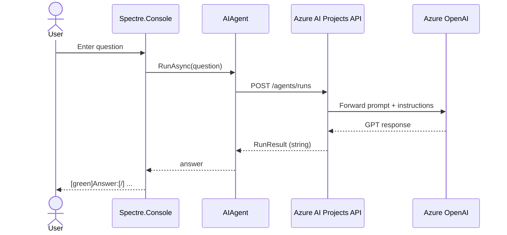
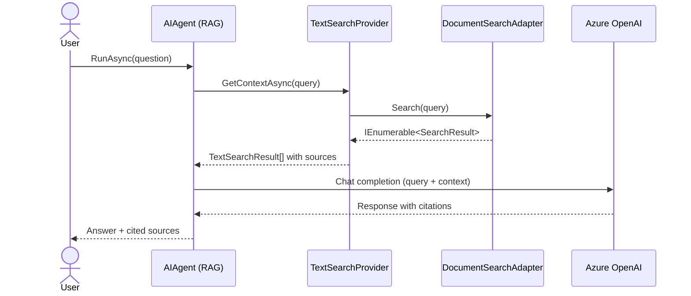

# 🏗 Architecture

This document provides a comprehensive overview of the Azure AI Agents solution architecture, component interactions, and design patterns.

> 📊 **Visual diagrams** (Mermaid): [Architecture & Flow Diagrams](./diagrams.md)

---

## 📐 System Architecture

```
┌─────────────────────────────────────────────────────────────────┐
│                        Azure Cloud                               │
│  ┌──────────────────────────────────────────────────────────┐   │
│  │           Azure AI Foundry Project                        │   │
│  │  ┌──────────────────┐      ┌──────────────────┐          │   │
│  │  │  Azure OpenAI    │      │   Azure AI       │          │   │
│  │  │   (GPT Models)   │◄────►│   Services       │          │   │
│  │  └──────────────────┘      └──────────────────┘          │   │
│  └──────────────────────────────────────────────────────────┘   │
│                            ▲                                     │
│                            │ HTTPS / REST API                    │
└────────────────────────────┼─────────────────────────────────────┘
                             │
                             │ DefaultAzureCredential
                             │
┌────────────────────────────┼─────────────────────────────────────┐
│                   Local Application                              │
│                            │                                      │
│  ┌─────────────────────────┼───────────────────────────────┐    │
│  │        ASE.SimpleAgent  │                                │    │
│  │  ┌────────────────────────────────────┐                 │    │
│  │  │       AIAgent Instance              │                 │    │
│  │  │  - Instructions                     │                 │    │
│  │  │  - Model Deployment                 │                 │    │
│  │  │  - Azure Credentials                │                 │    │
│  │  └────────────────────────────────────┘                 │    │
│  └──────────────────────────────────────────────────────────┘   │
│                                                                   │
│  ┌──────────────────────────────────────────────────────────┐   │
│  │    ASE.SimpleAgentSearch                                  │   │
│  │  ┌──────────────────────────────────────────┐            │   │
│  │  │         IChatClient (OpenAI)              │            │   │
│  │  │  - Chat Completion API                    │            │   │
│  │  │  - Streaming Support                      │            │   │
│  │  └──────────────────────────────────────────┘            │   │
│  │              │                                             │   │
│  │              ▼                                             │   │
│  │  ┌──────────────────────────────────────────┐            │   │
│  │  │      AIAgent (with Search)                │            │   │
│  │  │  - Text Search Provider                   │            │   │
│  │  │  - RAG Implementation                     │            │   │
│  │  │  - Session Management                     │            │   │
│  │  └──────────────────────────────────────────┘            │   │
│  │              │                                             │   │
│  │              ▼                                             │   │
│  │  ┌──────────────────────────────────────────┐            │   │
│  │  │     TextSearchProvider                    │            │   │
│  │  │  - Query Processing                       │            │   │
│  │  │  - Result Aggregation                     │            │   │
│  │  └──────────────────────────────────────────┘            │   │
│  │              │                                             │   │
│  │              ▼                                             │   │
│  │  ┌──────────────────────────────────────────┐            │   │
│  │  │     ASE.Libraries.DocumentSearchAdapter   │            │   │
│  │  │  - Keyword Matching                       │            │   │
│  │  │  - Search Result Formatting               │            │   │
│  │  │  - Source Citation                        │            │   │
│  │  └──────────────────────────────────────────┘            │   │
│  └──────────────────────────────────────────────────────────┘   │
│                                                                   │
│  ┌──────────────────────────────────────────────────────────┐   │
│  │        ASE.Libraries (Shared Components)                  │   │
│  │  ┌────────────────────────────────────┐                  │   │
│  │  │    DocumentSearchAdapter            │                  │   │
│  │  │    SearchResult                     │                  │   │
│  │  └────────────────────────────────────┘                  │   │
│  └──────────────────────────────────────────────────────────┘   │
└───────────────────────────────────────────────────────────────────┘
```

---

## 🧩 Component Breakdown

### 1. **ASE.SimpleAgent** 🤖

**Purpose:** Foundational AI agent with direct Azure AI integration.

**Key Components:**
- `AIProjectClient` - Manages Azure AI Foundry project connection
- `DefaultAzureCredential` - Handles Azure authentication
- `AIAgent` - Core agent instance with instructions
- `Spectre.Console` - User interface for console interaction

**Data Flow:**
```
User Input → AIAgent → Azure AI Projects API → Azure OpenAI → Response → User
```

**Dependencies:**
- `Azure.AI.Projects` (2.0.0)
- `Azure.Identity` (1.21.0)
- `Microsoft.Agents.AI.Foundry` (1.1.0)
- `Spectre.Console` (0.55.0)

📖 **Microsoft Learn:** [Azure AI Projects SDK](https://learn.microsoft.com/dotnet/api/overview/azure/ai.projects.agents-readme?view=azure-dotnet)

---

### 2. **ASE.SimpleAgentSearch** 🔍

**Purpose:** Enhanced agent with RAG (Retrieval-Augmented Generation) capabilities.

**Key Components:**
- `AzureOpenAIClient` - Direct OpenAI API access
- `IChatClient` - Chat completion interface
- `ChatClientBuilder` - Configures chat client with extensions
- `TextSearchProvider` - Implements RAG pattern
- `AgentSession` - Manages conversation state
- `DocumentSearchAdapter` - Backend search implementation

**Data Flow:**
```
User Query → AIAgent → TextSearchProvider → DocumentSearchAdapter
                ↓
            Azure OpenAI (with search context)
                ↓
         Cited Response → User
```

**Search Strategy:**
- **BeforeAIInvoke** - Searches before generating response
- Documents are retrieved based on query keywords
- Results include source citations

**Dependencies:**
- `Azure.AI.OpenAI` (via extensions)
- `Azure.Identity` (1.21.0)
- `Microsoft.Extensions.AI`
- `ASE.Libraries` (project reference)

📖 **Microsoft Learn:** [RAG with Text Search](https://learn.microsoft.com/agent-framework/concepts/rag)

---

### 3. **ASE.Libraries** 📦

**Purpose:** Shared library with reusable components.

**Components:**

#### `SearchResult` Class
```csharp
public sealed class SearchResult
{
    public string SourceName { get; init; } = string.Empty;
    public string SourceLink { get; init; } = string.Empty;
    public string Text { get; init; } = string.Empty;
}
```

**Properties:**
- `SourceName` - Display name of the document
- `SourceLink` - URL to source document
- `Text` - Content snippet matching the query

#### `DocumentSearchAdapter` Class
```csharp
public static class DocumentSearchAdapter
{
    public static IEnumerable<SearchResult> Search(string query)
}
```

**Functionality:**
- Case-insensitive keyword matching
- Returns policy documents based on query
- Extensible for production search backends

**Current Implementation:**
- Mock backend with return/refund policy documents
- Ready to be replaced with:
  - Azure AI Search
  - Azure Cosmos DB
  - Azure Cognitive Search
  - Custom search solutions

📖 **Microsoft Learn:** [Azure AI Search](https://learn.microsoft.com/azure/search/)

---

## 🔐 Authentication Architecture

### DefaultAzureCredential Chain

The solution uses `DefaultAzureCredential` which attempts authentication in this order:

```
1. Environment Variables
   ├─ AZURE_CLIENT_ID
   ├─ AZURE_TENANT_ID
   └─ AZURE_CLIENT_SECRET

2. Managed Identity
   └─ Azure resources (App Service, VM, etc.)

3. Visual Studio / VS Code
   └─ Signed-in account

4. Azure CLI
   └─ `az login` credentials

5. Azure PowerShell
   └─ `Connect-AzAccount` credentials
```

**⚠️ Production Consideration:**

For production environments, use specific credentials instead of `DefaultAzureCredential`:

```csharp
// Production example with Managed Identity
var credential = new ManagedIdentityCredential();

// Or with specific client credentials
var credential = new ClientSecretCredential(
    tenantId: "your-tenant-id",
    clientId: "your-client-id",
    clientSecret: "your-client-secret"
);
```

📖 **Microsoft Learn:** [DefaultAzureCredential Overview](https://learn.microsoft.com/dotnet/api/azure.identity.defaultazurecredential)

---

## 🔄 Design Patterns

### 1. **Builder Pattern**
Used in `ChatClientBuilder` to construct chat clients with extensions.

```csharp
IChatClient client = new ChatClientBuilder(baseClient)
    .Build();
```

### 2. **Adapter Pattern**
`DocumentSearchAdapter` abstracts the search backend implementation.

```csharp
public static IEnumerable<SearchResult> Search(string query)
{
    // Can be swapped with any search implementation
}
```

### 3. **Provider Pattern**
`TextSearchProvider` implements the AI context provider pattern.

```csharp
AIContextProviders = [new TextSearchProvider(SearchAdapter, options)]
```

### 4. **Dependency Injection** (Ready for extension)
The architecture supports DI for future enterprise features:

```csharp
// Future DI setup
services.AddSingleton<ISearchAdapter, DocumentSearchAdapter>();
services.AddScoped<IAIAgent, CustomAgent>();
```

📖 **Microsoft Learn:** [Dependency Injection in .NET](https://learn.microsoft.com/dotnet/core/extensions/dependency-injection)

---

## 📊 Data Flow Diagrams

> 📊 Full interactive diagrams: [diagrams.md](./diagrams.md)

### Simple Agent Flow



### Search-Enhanced Agent Flow



---

## 🚀 Scalability Considerations

### Current Architecture
- ✅ Stateless agent instances
- ✅ No local data persistence
- ✅ Cloud-native authentication
- ✅ Modular component design

### Enterprise Enhancements (Roadmap)

1. **Caching Layer**
   - Redis/Azure Cache for Redis
   - Response caching
   - Token usage optimization

2. **Vector Search**
   - Azure AI Search with vector indexing
   - Semantic search capabilities
   - Embedding generation

3. **API Gateway**
   - Azure API Management
   - Rate limiting
   - Authentication/authorization

4. **Monitoring & Logging**
   - Application Insights
   - Distributed tracing
   - Performance metrics

5. **State Management**
   - Azure Cosmos DB
   - Session persistence
   - Conversation history

📖 **Microsoft Learn:** [Azure Architecture Center](https://learn.microsoft.com/azure/architecture/)

---

## 🔗 Technology Stack Details

### Core Frameworks

| Package | Version | Purpose |
|---------|---------|---------|
| `Azure.AI.Projects` | 2.0.0 | Azure AI Foundry integration |
| `Azure.Identity` | 1.21.0 | Azure authentication |
| `Microsoft.Agents.AI.Foundry` | 1.1.0 | Agent framework abstractions |
| `Microsoft.Extensions.AI` | Latest | AI client abstractions |
| `Azure.AI.OpenAI` | Latest | OpenAI API client |

### UI & Utilities

| Package | Version | Purpose |
|---------|---------|---------|
| `Spectre.Console` | 0.55.0 | Rich console UI |
| `ModelContextProtocol.Core` | 1.2.0 | MCP support |

### Testing

| Package | Version | Purpose |
|---------|---------|---------|
| `xUnit` | 2.9.3 | Test framework |
| `Microsoft.NET.Test.Sdk` | 17.13.0 | Test runner |
| `coverlet.collector` | 6.0.3 | Code coverage |

---

## 📚 Additional Resources

- 📘 [Microsoft Agent Framework Architecture](https://learn.microsoft.com/agent-framework/overview/architecture)
- 📘 [Azure AI Projects SDK Architecture](https://learn.microsoft.com/dotnet/api/overview/azure/ai.projects.agents-readme?view=azure-dotnet)
- 📘 [RAG Pattern Best Practices](https://learn.microsoft.com/azure/ai-services/openai/concepts/use-your-data)
- 📘 [Azure Well-Architected Framework](https://learn.microsoft.com/azure/well-architected/)

---

*Building scalable AI agents with Azure 🚀*
