# 📊 Architecture & Flow Diagrams

Visual documentation of the Azure AI Agents solution — project structure, data flows, class relationships, and test coverage.

---

## 📁 Repository Overview

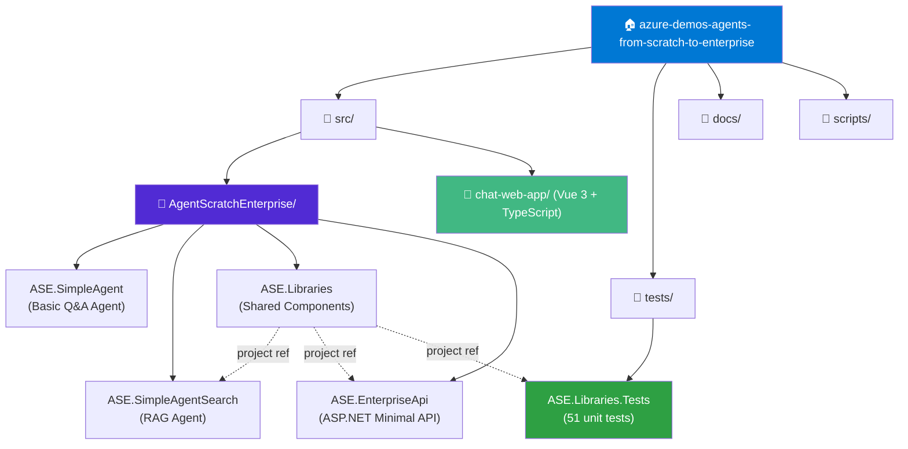

---

## 🏗 Solution Architecture

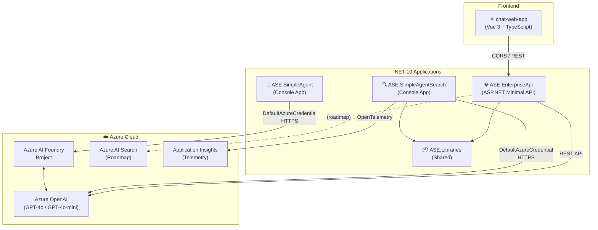

---

## 🤖 SimpleAgent — Data Flow

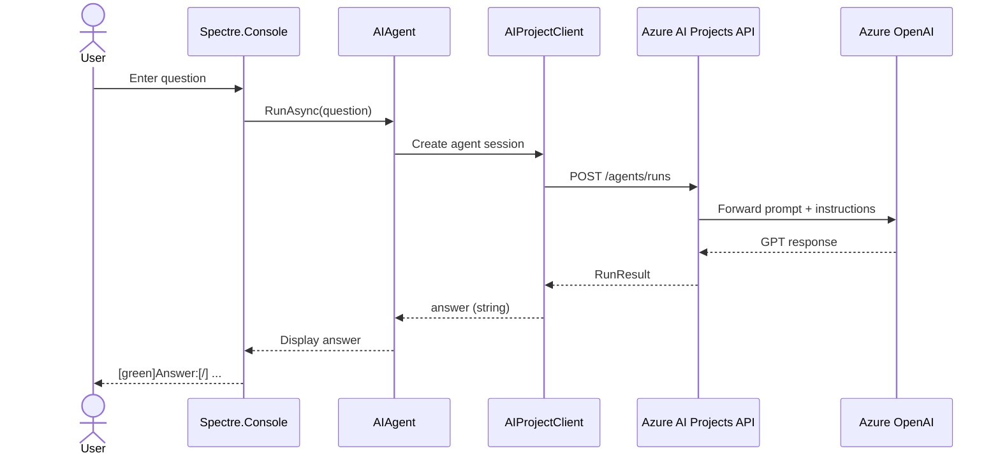

---

## 🔍 SimpleAgentSearch — RAG Flow

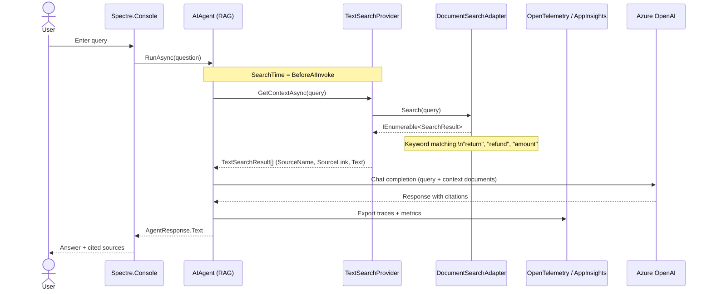

---

## 🌐 EnterpriseApi — Architecture & Request Flow

```mermaid
flowchart LR
    subgraph CLIENT["Client"]
        VUE["⚛️ Vue 3 App\n(chat-web-app)"]
    end

    subgraph API["ASE.EnterpriseApi (ASP.NET)"]
        CORS["CORS Policy\n(AllowVueApp)"]
        ROUTES["Route Group\n/basic/*"]
        CACHE["IMemoryCache"]
        HEALTH["Health Check\n/health"]
        EXH["Exception Handler"]

        subgraph ENDPOINTS["Endpoints"]
            GET["GET /basic/get-all\nLoadDataAsync()"]
            SEARCH["GET /basic/search?query=\nSearchAsync()"]
        end

        ROUTES --> ENDPOINTS
    end

    subgraph LIBS["ASE.Libraries"]
        DSA["DocumentSearchAdapter\n(LOCAL mode)"]
        AZSA["AzureSearchDocumentSearchAdapter\n(AZURE mode)"]
        BDG["BankDataGenerator\n(Bogus)"]
        ISS["ISearchService"]

        ISS <|.. DSA
        ISS <|.. AZSA
    end

    VUE -->|"HTTP GET"| CORS
    CORS --> ROUTES
    GET --> BDG
    SEARCH -->|"inject ISearchService"| ISS
    ISS --> DSA
    ISS --> AZSA
    CACHE -.->|"(future)"| SEARCH
```

---

## 🌐 EnterpriseApi — Request Sequence

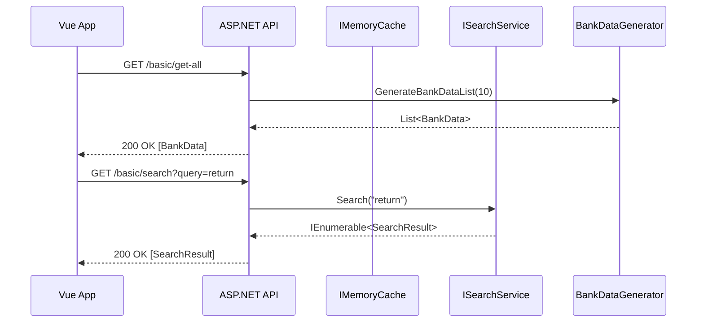

---

## 📦 ASE.Libraries — Class Diagram

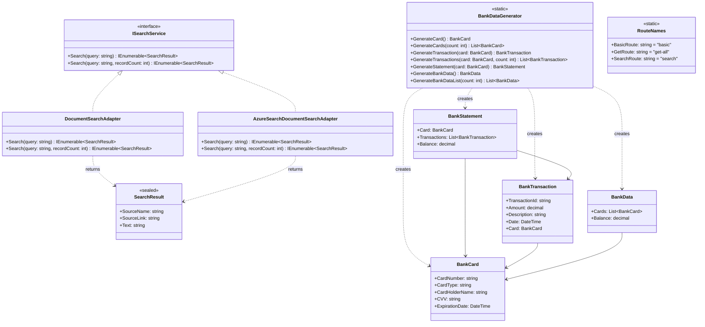

---

## 🧪 Test Coverage — Distribution

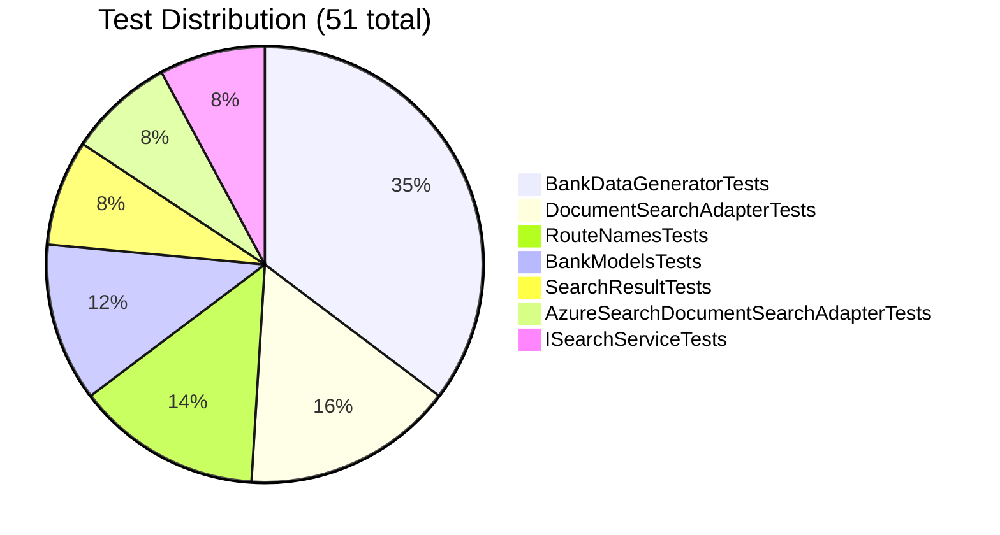

---

## 🧪 Test Architecture

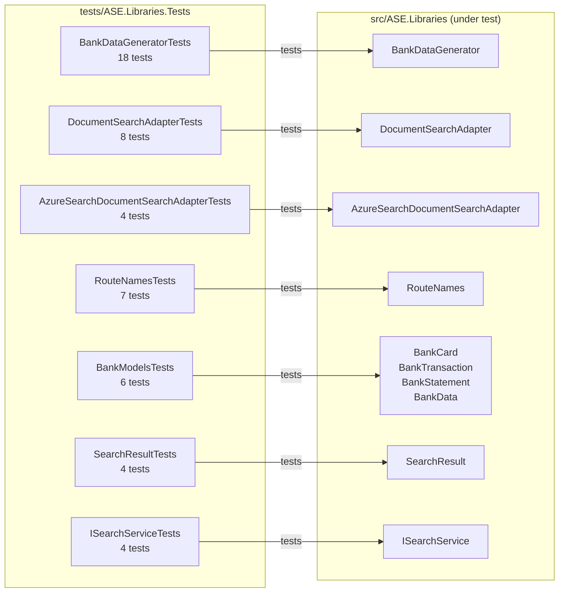

---

## 🔐 Authentication Chain

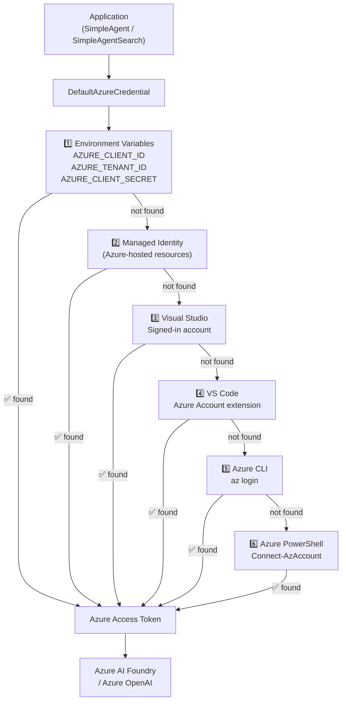

---

## 📦 Project Dependencies

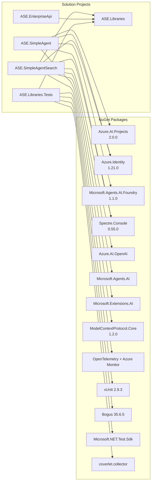

---

## 🗺 Progressive Enhancement Roadmap

```mermaid
graph LR
    P1["Phase 1 ✅\nASE.SimpleAgent\nBasic Q&A"]
    P2["Phase 2 ✅\nASE.SimpleAgentSearch\nRAG + Search"]
    P3["Phase 3 🔄\nVector Search\n(Azure AI Search)"]
    P4["Phase 4 🔄\nObservability\n(App Insights)"]
    P5["Phase 5 🔄\nEnterprise Security\n(EntraID + RBAC)"]

    P1 -->|"+ TextSearchProvider\n+ DocumentSearchAdapter"| P2
    P2 -->|"+ AzureSearchDocumentSearchAdapter\n+ Embeddings"| P3
    P3 -->|"+ OpenTelemetry\n+ Distributed Tracing"| P4
    P4 -->|"+ ManagedIdentity\n+ RBAC\n+ Audit Logging"| P5

    style P1 fill:#2EA043,color:#fff
    style P2 fill:#2EA043,color:#fff
    style P3 fill:#E3A008,color:#fff
    style P4 fill:#E3A008,color:#fff
    style P5 fill:#E3A008,color:#fff
```

---

## 🌐 Chat Web App — Component Structure

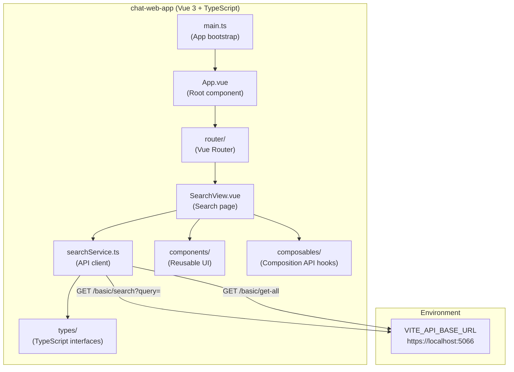

---

*Diagrams auto-rendered by GitHub and most Markdown viewers supporting Mermaid.*
