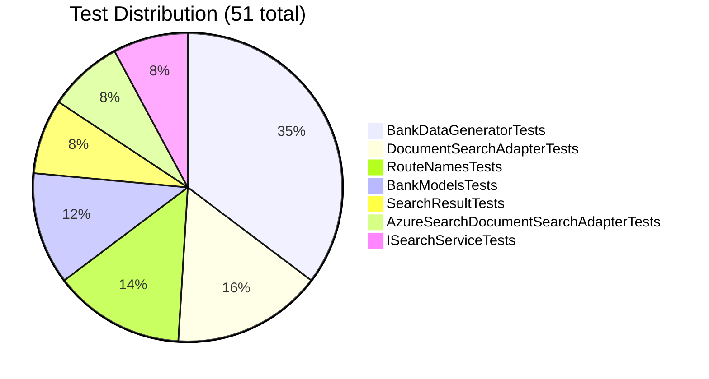

# 🧪 Testing Guide

This document covers the testing strategy, test execution, and coverage details for the Azure AI Agents project.

> 📊 **Visual diagrams** (Mermaid): [Test Architecture & Coverage Diagrams](./diagrams.md#-test-coverage--distribution)

---

## 📋 Testing Overview

The project includes comprehensive unit tests (.NET/xUnit) and end-to-end frontend tests (Playwright).

### Test Statistics

| Metric | Value |
|--------|-------|
| **Total .NET Tests** | 65 (51 library + 14 API options) |
| **Total Frontend E2E Tests** | 22 (Playwright) |
| **Passed Tests** | ✅ All |
| **Failed Tests** | ❌ 0 |
| **Test Frameworks** | xUnit 2.9.3 (backend), Playwright (frontend) |

---

## 🏗 Test Project Structure

```
tests/
├── ASE.Libraries.Tests/            ← Library unit tests (51 tests)
│   ├── ASE.Libraries.Tests.csproj
│   ├── GlobalUsings.cs
│   ├── DocumentSearchAdapterTests.cs           # 8 tests
│   ├── BankDataGeneratorTests.cs               # 18 tests
│   ├── SearchResultTests.cs                    # 4 tests
│   ├── BankModelsTests.cs                      # 6 tests
│   ├── AzureSearchDocumentSearchAdapterTests.cs # 4 tests
│   ├── RouteNamesTests.cs                      # 7 tests
│   └── ISearchServiceTests.cs                  # 4 tests
└── ASE.EnterpriseApi.Tests/        ← API options tests (14 tests)
    ├── ASE.EnterpriseApi.Tests.csproj
    ├── GlobalUsings.cs
    ├── CorsOptionsTests.cs                     # 6 tests
    └── SearchOptionsTests.cs                   # 8 tests

src/chat-web-app/tests/
└── search.spec.ts                  ← Playwright E2E tests (22 tests)
```

---

## 🚀 Running Tests

### Backend (.NET)

#### Run all tests
```bash
dotnet test
```

#### Run specific test project
```bash
cd tests\ASE.Libraries.Tests
dotnet test

cd tests\ASE.EnterpriseApi.Tests
dotnet test
```

#### Run with detailed output
```bash
dotnet test --logger "console;verbosity=detailed"
```

### Frontend (Playwright)

```bash
cd src\chat-web-app
npx playwright test
```

#### Run with UI report
```bash
npx playwright test --reporter=html
```

---

## 📝 Backend Test Cases

### `CorsOptionsTests` (6 tests) — `ASE.EnterpriseApi.Tests`

Tests for the `CorsOptions` configuration class.

| Test Name | Purpose |
|-----------|---------|
| `CorsOptions_WithValidOrigins_PassesValidation` | Single valid origin passes |
| `CorsOptions_WithMultipleOrigins_PassesValidation` | Multiple origins pass |
| `CorsOptions_WithNullOrigins_FailsValidation` | Null origins fail validation |
| `CorsOptions_WithEmptyOrigins_FailsValidation` | Empty array fails validation |
| `CorsOptions_SectionName_IsCorrect` | `SectionName` constant equals `"Cors"` |
| `CorsOptions_AllowedOrigins_DefaultsToEmpty` | Default constructor has empty origins |

---

### `SearchOptionsTests` (8 tests) — `ASE.EnterpriseApi.Tests`

Tests for the `SearchOptions` configuration class.

| Test Name | Purpose |
|-----------|---------|
| `SearchOptions_WithValidEnvironment_PassesValidation` | Non-empty string passes |
| `SearchOptions_WithNullEnvironment_FailsValidation` | Null environment fails |
| `SearchOptions_WithEmptyEnvironment_FailsValidation` | Empty string fails |
| `SearchOptions_WithWhitespaceEnvironment_FailsValidation` | Whitespace fails |
| `SearchOptions_SectionName_IsCorrect` | `SectionName` equals `"Search"` |
| `SearchOptions_Environment_DefaultsToNull` | Default constructor returns null |
| `SearchOptions_WithLocalEnvironment_PassesValidation` | `"LOCAL"` is valid |
| `SearchOptions_WithProductionEnvironment_PassesValidation` | `"PRODUCTION"` is valid |

---

### Library Tests (51 tests) — `ASE.Libraries.Tests`

See the existing sections below for full breakdowns of each test class.

### `DocumentSearchAdapterTests` (8 tests)

| Test Name | Purpose |
|-----------|---------|
| `Search_WithReturnQuery_ReturnsReturnPolicyResult` | Verifies "return" keyword triggers return policy |
| `Search_WithRefundQuery_ReturnsRefundPolicyResult` | Verifies "refund" keyword triggers refund policy |
| `Search_WithReturnQueryCaseInsensitive_ReturnsResult` | Tests case-insensitive search |
| `Search_WithAmountQuery_ReturnsBankTransactions` | Verifies bank transaction search |
| `Search_WithAmountQueryAndCustomRecordCount_RespectsRecordLimit` | Tests record count limiting |
| `Search_WithUnmatchedQuery_ReturnsEmptyResult` | Handles non-matching queries |
| `Search_ImplementsISearchService` | Verifies interface implementation |
| `Search_WithEmptyQuery_ReturnsEmptyResult` | Handles empty query gracefully |

---

### `BankDataGeneratorTests` (18 tests)

| Test Name | Purpose |
|-----------|---------|
| `GenerateCard_ReturnsValidBankCard` | Validates card generation |
| `GenerateCard_CardTypeIsValid` | Ensures valid card types |
| `GenerateCards_WithCount_ReturnsCorrectNumberOfCards` | Tests multiple card generation |
| `GenerateCards_DefaultCount_ReturnsTwoCards` | Tests default parameter behavior |
| `GenerateTransaction_WithCard_ReturnsValidTransaction` | Validates transaction generation |
| `GenerateTransactions_WithCount_ReturnsCorrectNumber` | Tests multiple transaction generation |
| `GenerateTransactions_AllTransactionsHaveSameCard` | Ensures transaction-card association |
| `GenerateStatement_CalculatesCorrectBalance` | Validates balance calculation |
| `GenerateBankData_ReturnsValidBankData` | Tests complete bank data generation |
| `GenerateBankDataWithStatement_ReturnsBankDataAndStatement` | Tests combined data generation |
| `GenerateBankDataList_ReturnsCorrectCount` | Tests list generation with custom count |
| `GenerateBankDataList_DefaultCount_ReturnsTenItems` | Tests default list generation |
| `GenerateBankDataWithStatementList_ReturnsCorrectCount` | Tests statement list with custom count |
| `GenerateBankDataWithStatementList_DefaultCount_ReturnsTenItems` | Tests default statement list |

---

## 📝 Frontend E2E Test Cases (Playwright)

### `Enterprise Search App` — Basic Search (12 tests)

| Test Name | Purpose |
|-----------|---------|
| `loads the search page with input and button visible` | Page renders correctly |
| `shows error when submitting empty query` | Empty query validation |
| `shows error when query is only whitespace` | Whitespace validation |
| `shows error when query is a single character` | Minimum length validation |
| `clears validation error when user starts typing` | Error clears on input |
| `displays results after a successful search` | API results render |
| `shows correct source name and text in result cards` | Card content correct |
| `shows result link when sourceLink is provided` | Link attribute set |
| `shows empty state when search returns no results` | Empty state shown |
| `shows error state when API returns an error` | Error state shown |
| `search button is disabled while loading` | Loading state works |
| `pressing Enter in search input triggers search` | Enter key submits |

### `Advanced Search` — Query + Highlighting (10 tests)

| Test Name | Purpose |
|-----------|---------|
| `loads the advanced search page with only query input and search button` | Simplified UI — no filter fields |
| `calls /advanced/search endpoint with query parameter` | Correct API endpoint used |
| `shows error when submitting empty query` | Validation |
| `shows error when query is a single character` | Min length validation |
| `displays results after a successful advanced search` | Results render |
| `shows empty state when advanced search returns no results` | Empty state |
| `shows error state when API returns an error` | Error state |
| `highlights matching query text in result cards` | `<mark>` tags present |
| `highlight marks contain the searched term (case-insensitive)` | Match is correct term |
| `clears highlights after reset` | Clear button resets state |

---

## 📊 Test Coverage Summary

### Backend Components

| Component | Test Count | Status |
|-----------|------------|--------|
| `CorsOptions` | 6 tests | ✅ Complete |
| `SearchOptions` | 8 tests | ✅ Complete |
| `DocumentSearchAdapter` | 8 tests | ✅ Comprehensive |
| `BankDataGenerator` | 18 tests | ✅ Comprehensive |
| `SearchResult` | 4 tests | ✅ Complete |
| `BankCard/Transaction/Statement/Data` | 10 tests | ✅ Complete |
| `AzureSearchDocumentSearchAdapter` | 4 tests | ✅ Complete |
| `RouteNames` | 7 tests | ✅ Complete |
| `ISearchService` | 4 tests | ✅ Complete |

### Frontend Components (Playwright)

| Feature | Test Count | Status |
|---------|------------|--------|
| Basic Search validation | 4 tests | ✅ Complete |
| Basic Search results | 8 tests | ✅ Complete |
| Advanced Search UI | 2 tests | ✅ Complete |
| Advanced Search results | 3 tests | ✅ Complete |
| Advanced Search validation | 2 tests | ✅ Complete |
| Text highlighting | 3 tests | ✅ Complete |

---

## 🔍 Test Best Practices Applied

### 1. **Arrange-Act-Assert Pattern**
All tests follow the AAA pattern for clarity.

### 2. **Descriptive Test Names**
```
[Method]_With[Scenario]_[ExpectedBehavior]
```

### 3. **Page Object Pattern (Playwright)**
Frontend tests use Page Objects (`SearchPage`, `AdvancedSearchPage`) to reduce duplication and centralise selectors.

### 4. **API Mocking (Playwright)**
All Playwright tests use `page.route()` to mock API responses — no live backend required.

### 5. **`data-testid` Selectors**
Frontend components expose `data-testid` attributes for stable test targeting:
- `search-input`, `search-button`, `validation-error`
- `advanced-query-input`, `advanced-search-button`, `advanced-validation-error`, `advanced-clear-button`
- `result-card`, `result-source`, `result-text`, `result-link`, `highlight`
- `results-list`, `empty-state`, `error-state`, `loading-state`

---

*Comprehensive testing ensures reliable AI agents! 🧪✅*

### Project Configuration

The test project targets **.NET 10.0** and includes the following packages:

```xml
<ItemGroup>
    <PackageReference Include="Microsoft.NET.Test.Sdk" Version="17.13.0" />
    <PackageReference Include="xUnit" Version="2.9.3" />
    <PackageReference Include="xunit.runner.visualstudio" Version="3.0.0" />
    <PackageReference Include="coverlet.collector" Version="6.0.3" />
    <PackageReference Include="Bogus" Version="35.6.5" />
</ItemGroup>
```

---

## 🚀 Running Tests

### Command Line

#### Run all tests
```bash
cd tests\ASE.Libraries.Tests
dotnet test
```

#### Run with detailed output
```bash
dotnet test --logger "console;verbosity=detailed"
```

#### Run with code coverage
```bash
dotnet test /p:CollectCoverage=true /p:CoverletOutputFormat=opencover
```

### Visual Studio

1. Open the solution in Visual Studio 2026
2. Open **Test Explorer** (Test → Test Explorer)
3. Click **Run All** to execute all tests
4. View results in the Test Explorer window

### Visual Studio Code

1. Install the [C# Dev Kit extension](https://marketplace.visualstudio.com/items?itemName=ms-dotnettools.csdevkit)
2. Open the Testing sidebar (flask icon)
3. Click **Run All Tests**

---

## 📝 Test Cases

### `DocumentSearchAdapterTests` (8 tests)

Comprehensive tests for the `DocumentSearchAdapter` class that handles search operations.

#### ✅ Test Coverage

| Test Name | Purpose |
|-----------|---------|
| `Search_WithReturnQuery_ReturnsReturnPolicyResult` | Verifies "return" keyword triggers return policy |
| `Search_WithRefundQuery_ReturnsRefundPolicyResult` | Verifies "refund" keyword triggers refund policy |
| `Search_WithReturnQueryCaseInsensitive_ReturnsResult` | Tests case-insensitive search |
| `Search_WithAmountQuery_ReturnsBankTransactions` | Verifies bank transaction search |
| `Search_WithAmountQueryAndCustomRecordCount_RespectsRecordLimit` | Tests record count limiting |
| `Search_WithUnmatchedQuery_ReturnsEmptyResult` | Handles non-matching queries |
| `Search_ImplementsISearchService` | Verifies interface implementation |
| `Search_WithEmptyQuery_ReturnsEmptyResult` | Handles empty query gracefully |

---

### `BankDataGeneratorTests` (18 tests)

Tests for the `BankDataGenerator` class that generates realistic bank data using the Bogus library.

#### ✅ Test Coverage

| Test Name | Purpose |
|-----------|---------|
| `GenerateCard_ReturnsValidBankCard` | Validates card generation |
| `GenerateCard_CardTypeIsValid` | Ensures valid card types |
| `GenerateCards_WithCount_ReturnsCorrectNumberOfCards` | Tests multiple card generation |
| `GenerateCards_DefaultCount_ReturnsTwoCards` | Tests default parameter behavior |
| `GenerateTransaction_WithCard_ReturnsValidTransaction` | Validates transaction generation |
| `GenerateTransactions_WithCount_ReturnsCorrectNumber` | Tests multiple transaction generation |
| `GenerateTransactions_AllTransactionsHaveSameCard` | Ensures transaction-card association |
| `GenerateStatement_CalculatesCorrectBalance` | Validates balance calculation |
| `GenerateBankData_ReturnsValidBankData` | Tests complete bank data generation |
| `GenerateBankDataWithStatement_ReturnsBankDataAndStatement` | Tests combined data generation |
| `GenerateBankDataList_ReturnsCorrectCount` | Tests list generation with custom count |
| `GenerateBankDataList_DefaultCount_ReturnsTenItems` | Tests default list generation |
| `GenerateBankDataWithStatementList_ReturnsCorrectCount` | Tests statement list with custom count |
| `GenerateBankDataWithStatementList_DefaultCount_ReturnsTenItems` | Tests default statement list |

---

### `SearchResultTests` (4 tests)

Tests for the `SearchResult` data model.

#### ✅ Test Coverage

| Test Name | Purpose |
|-----------|---------|
| `SearchResult_CanBeCreatedWithDefaultValues` | Validates default initialization |
| `SearchResult_CanBeCreatedWithInitializer` | Tests object initializer syntax |
| `SearchResult_PropertiesAreInitOnly` | Verifies init-only properties |
| `SearchResult_IsSealed` | Confirms sealed class modifier |

---

### `BankModelsTests` (6 tests)

Tests for all bank-related data models: `BankCard`, `BankTransaction`, `BankStatement`, and `BankData`.

#### ✅ BankCardTests (2 tests)

| Test Name | Purpose |
|-----------|---------|
| `BankCard_CanBeCreatedWithRequiredProperties` | Validates required property initialization |
| `BankCard_ExpirationDate_CanBeSet` | Tests expiration date setting |

#### ✅ BankTransactionTests (3 tests)

| Test Name | Purpose |
|-----------|---------|
| `BankTransaction_DefaultValues_AreSet` | Verifies default values |
| `BankTransaction_CanBeCreatedWithAllProperties` | Tests complete initialization |
| `BankTransaction_TransactionId_IsUniqueByDefault` | Ensures unique transaction IDs |

#### ✅ BankStatementTests (2 tests)

| Test Name | Purpose |
|-----------|---------|
| `BankStatement_CanBeCreatedWithRequiredProperties` | Validates required properties |
| `BankStatement_CanHoldTransactions` | Tests transaction collection |

#### ✅ BankDataTests (3 tests)

| Test Name | Purpose |
|-----------|---------|
| `BankData_CanBeCreatedWithRequiredProperties` | Validates initialization |
| `BankData_CanHoldMultipleCards` | Tests card collection |
| `BankData_Balance_CanBeSet` | Tests balance property |

---

### `AzureSearchDocumentSearchAdapterTests` (4 tests)

Tests for the `AzureSearchDocumentSearchAdapter` class (placeholder implementation).

#### ✅ Test Coverage

| Test Name | Purpose |
|-----------|---------|
| `AzureSearchDocumentSearchAdapter_ImplementsISearchService` | Verifies interface implementation |
| `Search_ThrowsNotImplementedException` | Validates not-yet-implemented status |
| `Search_WithRecordCount_ThrowsNotImplementedException` | Validates parameter handling |
| `AzureSearchDocumentSearchAdapter_CanBeInstantiated` | Tests object creation |

---

### `RouteNamesTests` (7 tests)

Tests for the `RouteNames` class containing route name constants.

#### ✅ Test Coverage

| Test Name | Purpose |
|-----------|---------|
| `BasicRoute_HasCorrectValue` | Validates "basic" constant value |
| `GetRoute_HasCorrectValue` | Validates "get-all" constant value |
| `SearchRoute_HasCorrectValue` | Validates "search" constant value |
| `RouteNames_ConstantsAreNotNull` | Ensures no null constants |
| `RouteNames_ConstantsAreNotEmpty` | Ensures no empty constants |
| `RouteNames_AllConstantsAreLowercase` | Validates lowercase convention |
| `RouteNames_ConstantsAreUnique` | Ensures no duplicate values |

---

### `ISearchServiceTests` (4 tests)

Tests for the `ISearchService` interface.

#### ✅ Test Coverage

| Test Name | Purpose |
|-----------|---------|
| `ISearchService_IsAnInterface` | Validates interface definition |
| `ISearchService_HasSearchMethod` | Verifies Search method exists |
| `DocumentSearchAdapter_ImplementsISearchService` | Tests implementation |
| `AzureSearchDocumentSearchAdapter_ImplementsISearchService` | Tests implementation |

---

## 🧪 Test Examples

### Basic Search Test

```csharp
[Fact]
public void Search_WithReturnQuery_ReturnsReturnPolicyResult()
{
    // Arrange
    var query = "return policy";

    // Act
    var results = _adapter.Search(query).ToList();

    // Assert
    Assert.NotEmpty(results);
    Assert.Contains(results, r => r.SourceName == "Contoso Outdoors Return Policy");
    Assert.Contains(results, r => r.Text.Contains("30 days"));
}
```

### Bank Data Generator Test

```csharp
[Fact]
public void GenerateCard_ReturnsValidBankCard()
{
    // Act
    var card = BankDataGenerator.GenerateCard();

    // Assert
    Assert.NotNull(card);
    Assert.NotEmpty(card.CardType);
    Assert.NotEmpty(card.CardNumber);
    Assert.NotEmpty(card.CardHolderName);
    Assert.NotEmpty(card.CVV);
    Assert.True(card.ExpirationDate > DateTime.Now);
}
```

### Model Validation Test

```csharp
[Fact]
public void SearchResult_CanBeCreatedWithInitializer()
{
    // Arrange
    var sourceName = "Test Source";
    var sourceLink = "https://example.com";
    var text = "Test content";

    // Act
    var result = new SearchResult
    {
        SourceName = sourceName,
        SourceLink = sourceLink,
        Text = text
    };

    // Assert
    Assert.Equal(sourceName, result.SourceName);
    Assert.Equal(sourceLink, result.SourceLink);
    Assert.Equal(text, result.Text);
}
```

---

## 📊 Test Coverage

### Coverage by Component

| Component | Test Count | Status |
|-----------|------------|--------|
| `DocumentSearchAdapter` | 8 tests | ✅ Comprehensive |
| `BankDataGenerator` | 18 tests | ✅ Comprehensive |
| `SearchResult` | 4 tests | ✅ Complete |
| `BankCard` | 2 tests | ✅ Complete |
| `BankTransaction` | 3 tests | ✅ Complete |
| `BankStatement` | 2 tests | ✅ Complete |
| `BankData` | 3 tests | ✅ Complete |
| `AzureSearchDocumentSearchAdapter` | 4 tests | ✅ Complete |
| `RouteNames` | 7 tests | ✅ Complete |
| `ISearchService` | 4 tests | ✅ Complete |

### Test Distribution



### Test Categories

- **Unit Tests**: 51 tests covering individual components
- **Integration Tests**: Coming in future releases
- **Performance Tests**: Coming in future releases

### Uncovered Scenarios

The following are **intentionally not tested** as they're application entry points or require live Azure services:

- `ASE.SimpleAgent/Program.cs` - Console app entry point
- `ASE.SimpleAgentSearch/Program.cs` - Console app entry point  
- `ASE.EnterpriseApi` - API endpoints (require integration tests)

These would require integration tests with live Azure services.

---

## 🔍 Test Best Practices Applied

### 1. **Arrange-Act-Assert Pattern**
All tests follow the AAA pattern for clarity:
```csharp
// Arrange - Set up test data
const string query = "test query";

// Act - Execute the method under test
var results = DocumentSearchAdapter.Search(query);

// Assert - Verify the outcome
Assert.NotEmpty(results);
```

### 2. **Descriptive Test Names**
Test names clearly describe the scenario and expected outcome:
```
[Method]_With[Scenario]_[ExpectedBehavior]
```

Examples:
- `Search_WithReturnKeyword_ReturnsReturnPolicyResult`
- `Search_WithNullQuery_ThrowsArgumentNullException`

### 3. **Single Assertion Focus**
Each test validates one specific behavior.

### 4. **Theory Tests for Similar Cases**
Data-driven tests reduce duplication:
```csharp
[Theory]
[InlineData("return")]
[InlineData("RETURN")]
public void Search_WithVariousCasing_ReturnsResults(string keyword)
```

### 5. **Edge Case Coverage**
Tests include:
- ✅ Null input
- ✅ Empty strings
- ✅ Case sensitivity
- ✅ Multiple keywords
- ✅ No matches

---

## 🎯 Future Testing Improvements

### Integration Tests
Test real Azure AI interactions:
```csharp
[Fact]
public async Task SimpleAgent_WithRealAzureAI_ReturnsValidResponse()
{
    // Requires live Azure credentials
    // Tests end-to-end agent interaction
}
```

### Performance Tests
Measure response times:
```csharp
[Fact]
public void Search_WithLargeDataset_CompletesUnderTimeLimit()
{
    // Benchmark search performance
}
```

### Load Tests
Simulate concurrent requests:
```csharp
[Fact]
public async Task Agent_HandlesMultipleConcurrentRequests()
{
    // Test scalability
}
```

---

## 🐛 Debugging Tests

### Run a Single Test
```bash
dotnet test --filter "FullyQualifiedName~Search_WithReturnKeyword"
```

### View Detailed Output
```bash
dotnet test --logger "console;verbosity=detailed"
```

### Debug in Visual Studio
1. Set a breakpoint in the test method
2. Right-click the test in Test Explorer
3. Select **Debug**

### Debug in VS Code
1. Set a breakpoint in the test file
2. Open the Testing sidebar
3. Right-click the test → **Debug Test**

---

## 📚 Testing Resources

### xUnit Documentation
- 📖 [xUnit.net Official Docs](https://xunit.net/)
- 📖 [xUnit Best Practices](https://xunit.net/docs/comparisons)

### .NET Testing
- 📖 [Unit Testing in .NET](https://learn.microsoft.com/dotnet/core/testing/)
- 📖 [Test-Driven Development](https://learn.microsoft.com/dotnet/core/testing/unit-testing-best-practices)

### Code Coverage
- 📖 [Coverlet Documentation](https://github.com/coverlet-coverage/coverlet)
- 📖 [Code Coverage in .NET](https://learn.microsoft.com/dotnet/core/testing/unit-testing-code-coverage)

---

## ✅ Test Checklist

Before committing code, ensure:

- ✅ All tests pass locally
- ✅ No failing tests
- ✅ New functionality has corresponding tests
- ✅ Test names follow naming conventions
- ✅ Edge cases are covered
- ✅ Tests are independent (no shared state)
- ✅ Tests run in under 5 seconds

---

## 🆘 Troubleshooting

### Tests Fail with ".NET 10 SDK Not Found"

**Solution:**
```bash
dotnet --version  # Verify .NET 10 is installed
```

### Tests Pass Locally But Fail in CI

**Common causes:**
- Environment variables not set
- Different .NET version
- Missing dependencies

### Test Coverage Reports Not Generated

**Solution:**
```bash
dotnet test /p:CollectCoverage=true /p:CoverletOutputFormat=opencover
```

---

*Comprehensive testing ensures reliable AI agents! 🧪✅*
